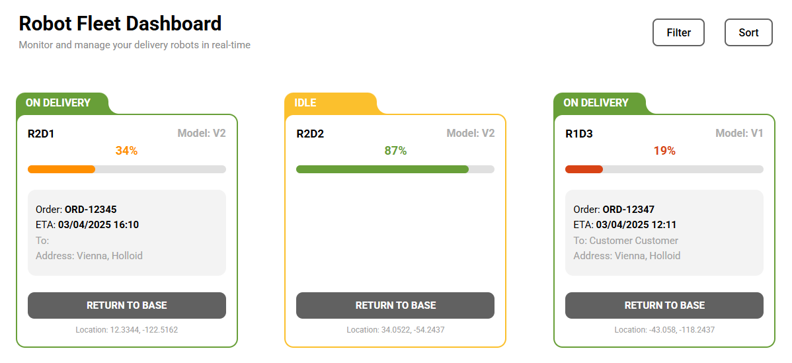

# Robot Fleet Dashboard

A responsive React dashboard application for monitoring and managing delivery robots.  
Built with **React** and **Vite** as part of the Holloid assignment challenge.

### Preview



## Features

- **Real-time fleet overview**: View status, battery, ID, order information, and location for each robot.
- **Return to Base**: Remotely change robot status with an action button (with disabled state & tooltip).
- **Status-aware UI**: Colors, backgrounds, and buttons adjust based on robot state and battery level.
- **Dynamic filtering**: Filter robots by status (On Delivery, Idle, Charging, Error, Returning).
- **Flexible sorting**: Sort robots by ID, battery level, or ETA in ascending/descending order.
- **Responsive design**: Optimized for desktop, tablet and mobile devices.

## Getting Started

### Prerequisites

- [Node.js](https://nodejs.org/) (v16 or later)
- [npm](https://www.npmjs.com/) or [yarn](https://yarnpkg.com/)

### Installation

1. Clone the repository

2. Install dependencies

   ```bash
   npm install
   ```

3. Get to the app location

   ```bash
   cd Delivery-Robot-Card
   ```

4. Run the app locally

   ```bash
   npm run dev
   ```

5. Open your browser
   - Visit `http://localhost:5173`

## Project Structure

```text
Delivery-Robot-Card/
├── public/
│   └── ...
├── src/
│   ├── components/
│   │   └── RobotCard/
│   │       ├── RobotCard.jsx                   # Individual card component
│   │       └── RobotCardStyles.module.css      # Card styles
│   ├── data/
│   │   └── robots.js                           # Sample data
│   ├── App.jsx                                 # Main component + dashboard code
│   ├── App.css                                 # Dashboard styles
│   └── main.jsx
├── package.json
```

## Usage

- **Filter**: Click "Filter" to select/deselect robot statuses. "Clear all" resets filters.
- **Sort**: Click "Sort" to choose the property and direction (asc/desc).
- **Return to Base**: Click the button on any card (enabled only for robots on delivery) to change the status to "Returning".
- **Tooltip**: Hover the disabled "Return to Base" for usage info.
- **Responsive**: Try resizing your browser or using on mobile.

## License

MIT — free for personal or commercial use.

## Author

Aleksandar Antonov
https://www.antonov.studio/
